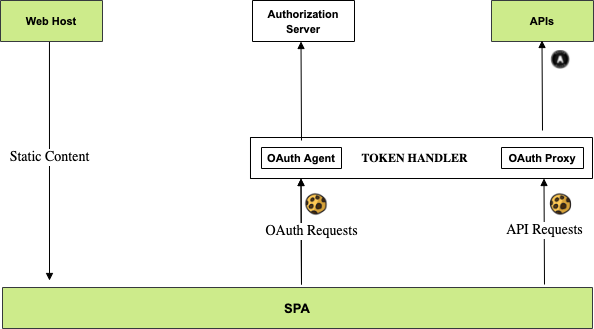

# Serverless Token Handler

The token handler provides cookie-secured API entry points for an SPA that run on a BFF domain.  

## Architecture

The token handler is a wildcard lambda, that provides low cost AWS hosting for my blog's final SPA.  
The lambda manages all web specific security, to keep the [Serverless API](https://github.com/gary-archer/oauth.apisample.serverless) focused on API concerns.  



## Run the Token Handler

Install OpenSSL 3+ if required, create a secrets folder, then create development certificates:

```bash
export SECRETS_FOLDER="$HOME/secrets"
mkdir -p "$SECRETS_FOLDER"
./certs/create.sh
```

Use Serverless Offline to run the token handler as a local API:

```bash
npm start
```

## Test the Token Handler

Install a UI test framework that can do browser logins:

```bash
npx playwright install-deps
npx playwright install
```

Then run the following command to test the cookie lifecycle:

```bash
npm test
```

## Deploy the Token Handler

I run this command to deploy the token handler to the AWS subdomain `bff.authsamples-dev.com`:

```bash
npm run deployDev
```

I run this command to deploy the token handler to the AWS subdomain `bff.authsamples.com`:

```bash
npm run deploy
```

## API Performance

API performance is a little suboptimal, due to the nature of the AWS API gateway:

- SPA requests first call the AWS API gateway for the BFF domain and invoke the wildcard lambda.  
- The wildcard lambdas then makes an upstream request to AWS API gateway for the API domain.  

See the [Cloud Native Token Handler](https://github.com/gary-archer/oauth.tokenhandler.cloudnative) for a better performing token handler with the same architecture.
